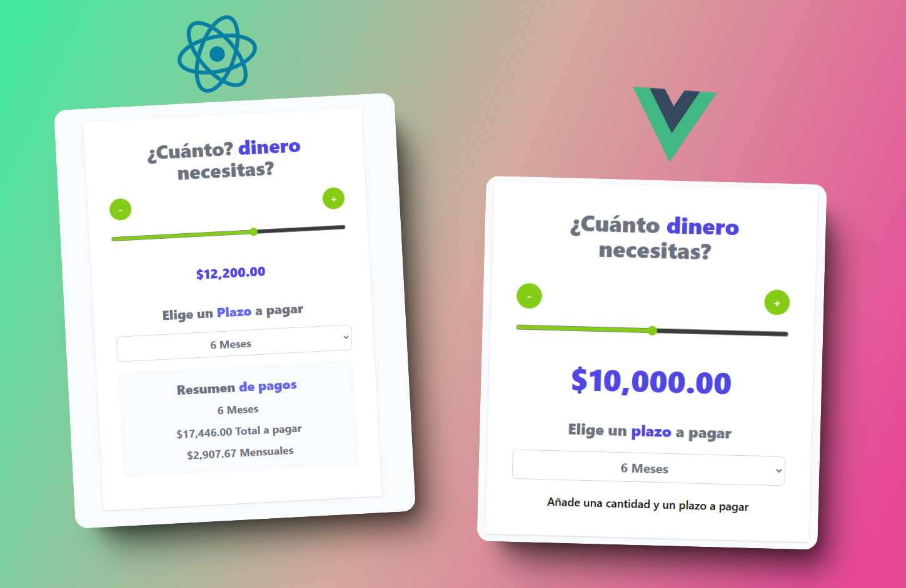

  

  ## Loan Calculator with React && Vue 

  
  
  
  

|   #  | Project Using | Code | Website | 
| :----: | :-------: | :----: | :-------: |
|   1  |  React  |   |   |
|   2  |  Vue.js  |   |   |